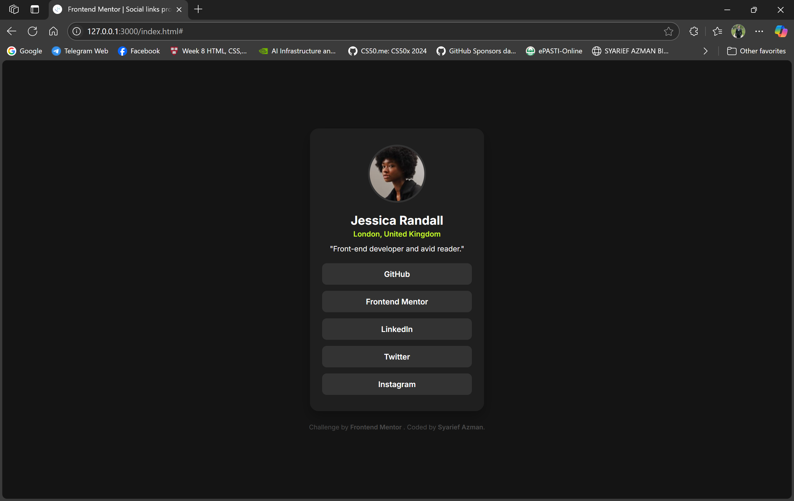

# Frontend Mentor - Social Links Profile Solution

This is my solution to the [Social Links Profile challenge on Frontend Mentor](https://www.frontendmentor.io/challenges/social-links-profile-UG32l9m6dQ). The goal was to build a responsive profile card using semantic HTML and modern CSS, complete with hover, focus, and active states for all interactive elements.

---

## Table of Contents

- [Overview](#overview)

  - [The Challenge](#the-challenge)
  - [Screenshot](#screenshot)
  - [Links](#links)

- [My Process](#my-process)

  - [Built With](#built-with)
  - [What I Learned](#what-i-learned)
  - [Continued Development](#continued-development)
  - [Useful Resources](#useful-resources)

- [Author](#author)
- [Acknowledgments](#acknowledgments)

---

## Overview

### The Challenge

- Build a profile card that closely matches the provided design.
- Ensure the card is fully responsive from 320px up to large desktop viewports.
- Implement hover, focus, and active states on each link button.
- Use semantic HTML5 markup and CSS custom properties for color and typography.

### Screenshot



> The screenshot above demonstrates the desktop view of the profile card. When a button is pressed (active state), it switches to the bright green accent color.

### Links

- **Solution Repository:** [https://github.com/syarief02/social-links-profile](https://github.com/syarief02/social-links-profile)
- **Live Site:** [https://syarief02.github.io/social-links-profile](https://syarief02.github.io/social-links-profile)

---

## My Process

### Built With

- **HTML5** – Semantic markup to structure the profile card
- **CSS3** – Modern features like Flexbox, CSS variables, and transitions
- **Responsive Workflow** – Mobile-first approach, testing from 320px to 1440px+
- **Flexbox** – Centering and stacking elements inside the card
- **CSS Custom Properties** – Centralized color palette and typography settings

### What I Learned

- **Semantic Structure:**
  I used `<header>`, `<h1>`, `<p>`, and `<a>` elements to ensure the markup is clear and accessible.

  ```html
  <div class="card">
    
    <h1 class="name">Jessica Randall</h1>
    <p class="location">London, United Kingdom</p>
    <p class="description">"Front-end developer and avid reader."</p>
    <div class="links">
      <a href="#" class="link-btn">GitHub</a>
      <!-- ...other links... -->
    </div>
  </div>
  ```

- **CSS Variables for Color & Typography:**
  Defining colors once in `:root` allowed me to maintain consistency and easily tweak hues if needed.

  ```css
  :root {
    --green: hsl(75, 94%, 57%);
    --white: hsl(0, 0%, 100%);
    --grey-700: hsl(0, 0%, 20%);
    --grey-800: hsl(0, 0%, 12%);
    --grey-900: hsl(0, 0%, 8%);
    --font-family: "Inter", sans-serif;
  }

  html {
    font-size: 14px; /* Base for body copy */
  }
  ```

- **Hover, Focus, and Active States:**
  I made sure each button has a clear hover effect, a visible focus outline for accessibility, and a distinct active (pressed) state that flips to the neon green accent.

  ```css
  .link-btn {
    background-color: var(--grey-700);
    color: var(--white);
    transition: background-color 0.2s ease-in-out, color 0.2s ease-in-out,
      transform 0.1s ease-in-out;
  }

  .link-btn:hover {
    background-color: var(--grey-600);
  }

  .link-btn:focus {
    outline: 2px solid var(--green);
    outline-offset: 2px;
  }

  .link-btn:active {
    background-color: var(--green);
    color: var(--grey-900);
    transform: translateY(1px);
  }
  ```

- **Flexbox Centering:**
  To center the card both vertically and horizontally on all screen sizes, I used:

  ```css
  body {
    display: flex;
    align-items: center;
    justify-content: center;
    min-height: 100vh;
    background-color: var(--grey-900);
  }
  ```

### Continued Development

- **Accessibility Improvements:**
  I plan to refine the focus styles by using `:focus-visible` so that the outline only appears for keyboard users, reducing visual clutter for mouse users.
- **Responsive Scaling Tweaks:**
  While the card is fixed at 300px wide per the design, I’d like to experiment with relative widths (e.g., `max-width: 90vw` and `min-width: 280px`) so that on extremely narrow viewports it still scales gracefully.
- **Animation/Transition Enhancements:**
  Adding subtle fade‐in transitions when scrolling into view, or a slight bounce when switching active states, could add polish.
- **Dark Mode Toggle:**
  Even though this design is already a dark theme, I may add a toggle switch in future projects to switch between light/dark palettes using CSS custom properties.

### Useful Resources

- **Frontend Mentor Challenge** – The official challenge page with design assets and style guide
  [https://www.frontendmentor.io/challenges/social-links-profile-UG32l9m6dQ](https://www.frontendmentor.io/challenges/social-links-profile-UG32l9m6dQ)
- **CSS-Tricks: Custom Properties** – A deep dive into using CSS variables effectively
  [https://css-tricks.com/guides/css-custom-properties/](https://css-tricks.com/guides/css-custom-properties/)
- **MDN: Accessible Rich Internet Applications** – Best practices for focus states and keyboard navigation
  [https://developer.mozilla.org/en-US/docs/Web/Accessibility/ARIA](https://developer.mozilla.org/en-US/docs/Web/Accessibility/ARIA)
- **Flexbox Guide** – A comprehensive overview of Flexbox layout techniques
  [https://css-tricks.com/snippets/css/a-guide-to-flexbox/](https://css-tricks.com/snippets/css/a-guide-to-flexbox/)

---

## Author

- **Name:** Syarief Azman
- **GitHub:** [@syarief02](https://github.com/syarief02)
- **Frontend Mentor:** [@syarief02](https://www.frontendmentor.io/profile/syarief02)
- **Twitter:** [@syariefazman](https://twitter.com/syariefazman)

Feel free to connect with me if you have questions or feedback about this project!

---

## Acknowledgments

- Thanks to the Frontend Mentor team for providing high‐quality design challenges with clear style guides.
- Shout‐out to the CSS‐Tricks community for excellent articles on CSS variables and Flexbox centering.
- Thanks to [Undraw](https://undraw.co/) for inspiring accessible, responsive design patterns.
